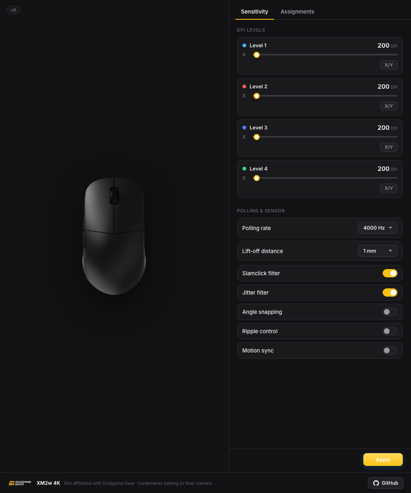
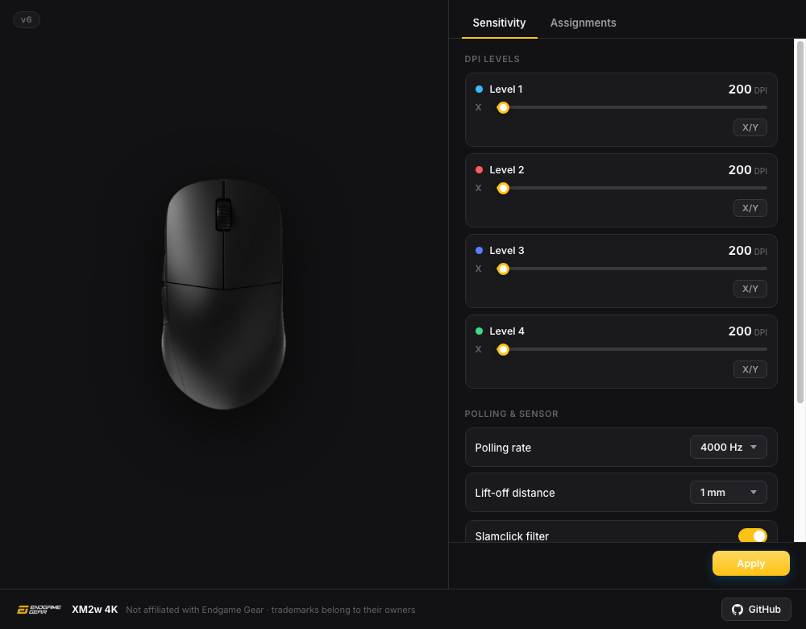
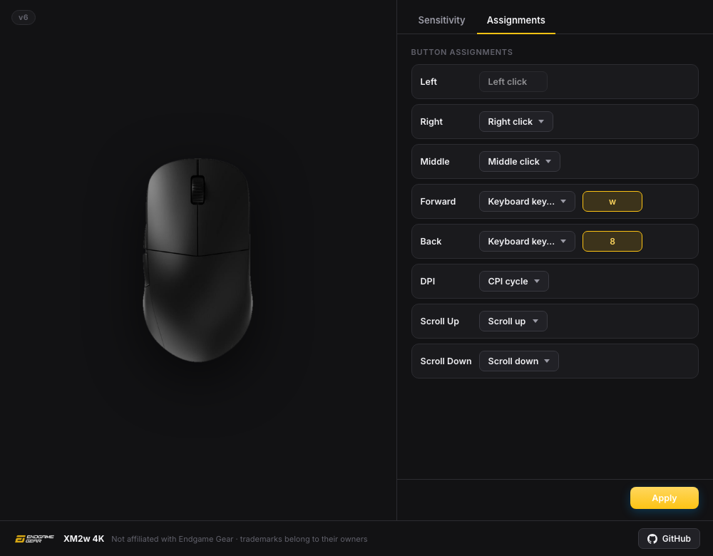

# XM2w Control

Configure your **Endgame Gear XM2w 4K** on macOS and Linux.



## Features

* Four editable DPI levels with separate X/Y values
* 1000, 2000, and 4000 Hz polling
* Lift-off distance and sensor filters
* Full button remapping
* Keyboard keys and key combinations
* Built-in mouse emulator

## Interface

| Sensitivity                                       | Assignments                                       |
| ------------------------------------------------- | ------------------------------------------------- |
|  |  |

## Run

```sh
cd src-tauri
cargo run --bin xm2w
```

Run without a mouse:

```sh
cargo run --bin xm2w -- --emu
```

## License

[MIT](LICENSE)

> XM2w Control is unofficial and is not affiliated with Endgame Gear.
